# Polkadot Substrate Development Bootcamp

 Welcome to the **Polkadot Substrate Development Bootcamp Final Project.** In this project, the following requirements have been realized and explained supported by screen shots.

 - Building a blockchain
 - Simulating a substrate network
 - Adding trusted nodes to a network
 - Smart contracts

## Table of Contents

- [1. Getting Started](#1-getting-started)
  - [1.1. Prerequisites](#11-prerequisites) 
  - [1.2. Installation](#12-installation) 
- [2. Building a blockchain](#2-building-a-blockchain)
  - [2.1. Node](#21-node) 
  - [2.2. Frontend](#22-frontend) 
  - [2.3. Stop the node and front-end template](#23-stop-the-node-and-front-end-template) 
- [3. Simulating a substrate network](#3-simulating-a-substrate-network)
- [4. Adding trusted nodes to a network](#4-adding-trusted-nodes-to-a-network)
  - [4.1. Generate the accounts and keys](#41-generate-the-accounts-and-keys)
  - [4.2. Create a custom chain specification](#42-create-a-custom-chain-specification)
  - [4.3. Convert the chain specification to raw format](#43-convert-the-chain-specification-to-raw-format)
  - [4.4. Start the first node](#44-start-the-first-node)
  - [4.5. Start the second node](#45-start-the-second-node)
- [5. Smart Contracts](#5-smart-contracts)
  - [5.1. Prerequisites](#51-prerequisites)
  - [5.2. Create a new smart contract project](#52-create-a-new-smart-contract-project)
  - [5.3. Compile the contract](#53-compile-the-contract)
  - [5.4. Run a Substrate node and deploy the contract](#54-run-a-substrate-node-and-deploy-the-contract)
  - [5.5. Call the contract](#55-call-the-contract)
    - [5.5.1. Call the contract with command line](#551-call-the-contract-with-command-line)
    - [5.5.2. Call the contract with Contracts UI](#552-call-the-contract-with-contracts-ui)
- [6. References](#6-references)
- [7. License](#7-license)

## 1. Getting Started

The project is built on the following system and application versions.

- **OS:** Ubuntu [Windows 10] x86_64
- **Kernel:** 5.15.90.1-microsoft-standard-WSL2
- **rust:** 1.72.0
- **node:** v18.17.1
- **yarn:** 1.22.19

### 1.1. Prerequisites

- Rust: [Installation](https://www.rust-lang.org/learn/get-started)
- Node.js: [Installation](https://nodejs.org/en/download)
- Yarn: [Installation](https://classic.yarnpkg.com/en/docs/install)

### 1.2. Installation

a. Add the `nightly` release and the `nightly` WebAssembly (wasm) targets to your development environment:

```bash
rustup default stable
rustup update nightly
rustup target add wasm32-unknown-unknown --toolchain nightly
```

b. Clone the node template repository and navigate to the root:

```bash
git clone https://github.com/substrate-developer-hub/substrate-node-template
cd substrate-node-template/
```

c. Create a new branch for save the changes:

```bash
git switch -c bootcamp
```

d. Compile the node template:

```bash
cargo build --release
```

## 2. Building a blockchain

### 2.1. Node

a. Start the node in development node:

```bash
./target/release/node-template --dev
```

Console output should look like the picture  

 

### 2.2. Frontend

a. In new terminal, clone the front-end template and navigate to the root:

```bash
git clone https://github.com/substrate-developer-hub/substrate-front-end-template
cd substrate-front-end-template
```

b. Install the dependencies:

```bash
yarn install
```

c. Start the front-end template:

```bash
yarn start
```

Go to the http://localhost:8000/substrate-front-end-template.  
The site should look like the image

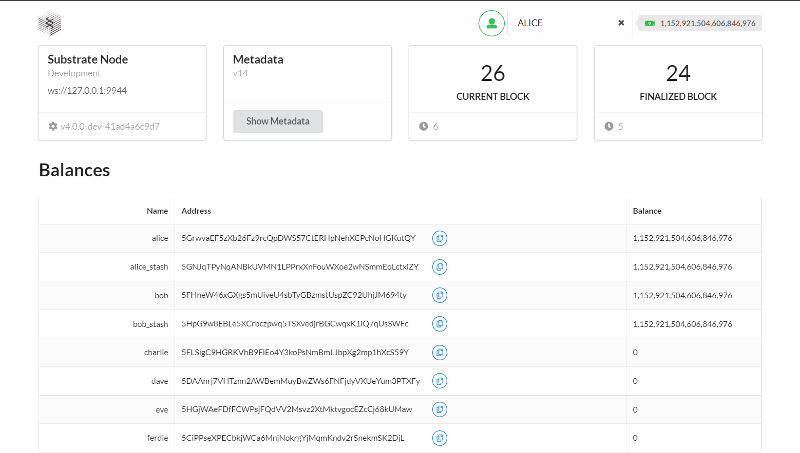 

### 2.3. Stop the node and front-end template

1. Return to the terminal shell where the node output is displayed.
2. Press Control-C to terminate the running process.
3. Return to the terminal shell where the yarn output is displayed then repeat the **step 2**.

## 3. Simulating a substrate network

a. Purge old chain data:

```bash
# Working directory is substrate-node-template.
# After running this command, press 'y' to confirm.
./target/release/node-template purge-chain --base-path /tmp/bob --chain local
```

b. Start the local blockchain node using `bob` account:

```bash
./target/release/node-template \
--base-path /tmp/bob \
--chain local \
--bob \
--port 30333 \
--rpc-port 9945 \
--node-key 0000000000000000000000000000000000000000000000000000000000000001 \
--telemetry-url "wss://telemetry.polkadot.io/submit/ 0" \
--validator
```

Console output should look like the picture  

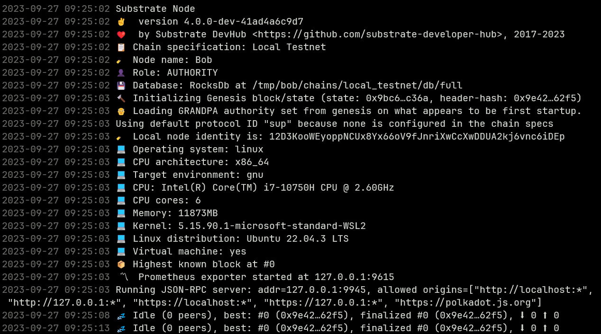  

c. Add a second node to the network:

```bash
# Open new terminal and change the directory to substrate-node-template
# Purge old chain data
./target/release/node-template purge-chain --base-path /tmp/alice --chain local -y
# Start second node
./target/release/node-template \
--base-path /tmp/alice \
--chain local \
--alice \
--port 30334 \
--rpc-port 9946 \
--telemetry-url "wss://telemetry.polkadot.io/submit/ 0" \
--validator \
--bootnodes /ip4/127.0.0.1/tcp/30333/p2p/12D3KooWEyoppNCUx8Yx66oV9fJnriXwCcXwDDUA2kj6vnc6iDEp
```

Console output should look like the picture  

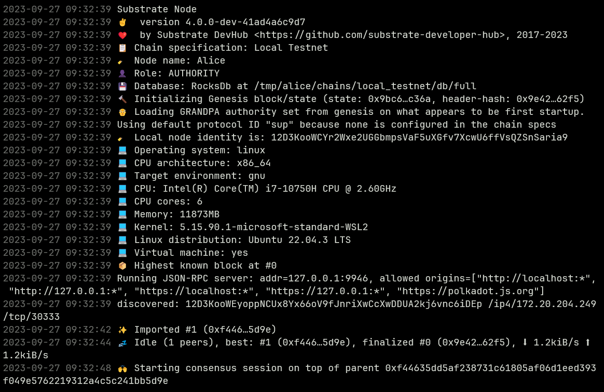 

Go to the https://polkadot.js.org/apps/?rpc=ws%3A%2F%2F127.0.0.1%3A9946#/explorer  
This page should look like the picture

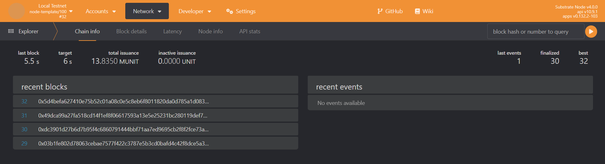 

d. Stop the nodes and remove the old chain data:

```bash
# Before running the following command, 
# open the terminal where you started the Alice node and press Control+c
./target/release/node-template purge-chain --base-path /tmp/alice --chain local -y

# After previous command,
# open the other terminal (where you started the Bob node) and press Control+c
# then running the following command
./target/release/node-template purge-chain --base-path /tmp/bob --chain local -y
```

## 4. Adding trusted nodes to a network

### 4.1. Generate the accounts and keys

a. Generate a random secret pharse and keys:

```bash
# Change working directory to substrate-node-template
# After running this command, type a password and press enter
./target/release/node-template key generate --scheme Sr25519 --password-interactive
```

> Note the values that will be displayed in the console output. We will use the following public key for producing blocks using `aura` (authority round) for one node.

```bash
Secret phrase:       solution water resemble right twenty plastic team page photo say skill someone
  Network ID:        substrate
  Secret seed:       0xbf5d639e3dd4b7acf882577b4266a7baffb2247b0b7d589e1c92d1e2df5facbd
  Public key (hex):  0x9e7db40b6e91d411ad33e04a7b02b2bd55773f3afe5d0a60013e82dc0de94f32
  Account ID:        0x9e7db40b6e91d411ad33e04a7b02b2bd55773f3afe5d0a60013e82dc0de94f32
  Public key (SS58): 5FeWmJSsgoSCosn72i2Ygaf7bQtMpDWCaXUNYAEyo8t3Q7XL
  SS58 Address:      5FeWmJSsgoSCosn72i2Ygaf7bQtMpDWCaXUNYAEyo8t3Q7XL
```

b. Use the `secret phrase` value to derive keys using the Ed25519 signature scheme:

```bash
# After running this command, type the password and press enter
./target/release/node-template key inspect --password-interactive --scheme Ed25519 "solution water resemble right twenty plastic team page photo say skill someone"
```

> Note the values that will be displayed in the console output. We will use the following public key for finalizing blocks using `grandpa` for one node.

```bash
Secret phrase:       solution water resemble right twenty plastic team page photo say skill someone
  Network ID:        substrate
  Secret seed:       0xbf5d639e3dd4b7acf882577b4266a7baffb2247b0b7d589e1c92d1e2df5facbd
  Public key (hex):  0x164281c6966ab14e15f4613ff96823f1a633716b67f1dce7f32530a7bc8ca454
  Account ID:        0x164281c6966ab14e15f4613ff96823f1a633716b67f1dce7f32530a7bc8ca454
  Public key (SS58): 5CZtff5zSN6ahmGKhkut8Vxb7YTVZQNooG7jUGfvbWboE243
  SS58 Address:      5CZtff5zSN6ahmGKhkut8Vxb7YTVZQNooG7jUGfvbWboE243
```

> First set of keys:
> - Sr25519 (`aura`): `5FeWmJSsgoSCosn72i2Ygaf7bQtMpDWCaXUNYAEyo8t3Q7XL`
> - Ed25519 (`grandpa`): `5CZtff5zSN6ahmGKhkut8Vxb7YTVZQNooG7jUGfvbWboE243`

c. Repeat the step 1 and step 2 using a different identity on your local computer to generate a second set of keys:

> In this example, the second set of keys obtained after the steps using the different identity:
> - Sr25519 (`aura`): `5EWRQAJje3StoF6pvTQfYidiXNvCYqL48ZspBuumWLWcvqy8`
> - Ed25519 (`grandpa`): `5CMYv7pPtbwrJvjzj4AbRJHtWR46VABcdJcs8rtdePz9erno`

### 4.2. Create a custom chain specification

a. Export the local chain specification to a file named `customSpec.json`:

```bash
# Change working directory to substrate-node-template
./target/release/node-template build-spec --disable-default-bootnode --chain local > customSpec.json
```

b. Update the `customSpec.json`

b.1. Update `name` field if you want.

```json
"name": "Bootcamp Testnet"
```

b.2. Modify `aura` field, add the Sr25519 keys for each node.

```json
"aura": {
  "authorities": [
    "5FeWmJSsgoSCosn72i2Ygaf7bQtMpDWCaXUNYAEyo8t3Q7XL",
    "5EWRQAJje3StoF6pvTQfYidiXNvCYqL48ZspBuumWLWcvqy8"
  ]
}
```

b.3. Modify `grandpa` field, add the Ed25519 keys for each node.

```json
"grandpa": {
  "authorities": [
    [
      "5CZtff5zSN6ahmGKhkut8Vxb7YTVZQNooG7jUGfvbWboE243",
      1
    ],
    [
      "5CMYv7pPtbwrJvjzj4AbRJHtWR46VABcdJcs8rtdePz9erno",
      1
    ]
  ]
}
```

### 4.3. Convert the chain specification to raw format

Convert the `chainSpec.json` chain specification to the raw format:

```bash
# Change working directory to substrate-node-template
./target/release/node-template build-spec --chain=customSpec.json --raw --disable-default-bootnode > customSpecRaw.json
```

### 4.4. Start the first node

a. Start the node:

```bash
# After running this command, type the password and press enter
./target/release/node-template \
--base-path /tmp/node1 \
--chain ./customSpecRaw.json \
--port 30333 \
--rpc-port 9945 \
--telemetry-url "wss://telemetry.polkadot.io/submit/ 0" \
--validator \
--rpc-methods Unsafe \
--name Node1 \
--password-interactive
```

b. Insert the `aura` secret key generated from the `key` subcommand:

```bash
# Open new terminal and change working directory to substrate-node-template
# After running this command, type the password and press enter
./target/release/node-template key insert --base-path /tmp/node1 \
--chain customSpecRaw.json \
--scheme Sr25519 \
--suri "solution water resemble right twenty plastic team page photo say skill someone" \
--password-interactive \
--key-type aura
```

c. Insert the `grandpa` secret key generated from the `key` subcommand:

```bash
# After running this command, type the password and press enter
./target/release/node-template key insert \
--base-path /tmp/node1 \
--chain customSpecRaw.json \
--scheme Ed25519 \
--suri "solution water resemble right twenty plastic team page photo say skill someone" \
--password-interactive \
--key-type gran
```

d. Verify that your keys are in the keystore for `node1`:

```bash
ls /tmp/node1/chains/local_testnet/keystore
```

Console output should look like the picture  

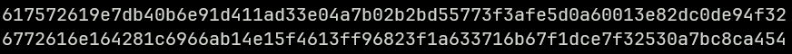</br>

e. After you have added your keys to the keystore for the first node under `/tmp/node1`, you can restart the node (step a.)

### 4.5. Start the second node

a. Start the node:

```bash
# Open new terminal on different identity and change working directory to substrate-node-template
# After running this command, type the password and press enter
./target/release/node-template \
--base-path /tmp/node2 \
--chain ./customSpecRaw.json \
--port 30334 \
--rpc-port 9946 \
--telemetry-url "wss://telemetry.polkadot.io/submit/ 0" \
--validator \
--rpc-methods Unsafe \
--name MyNode2 \
--bootnodes /ip4/127.0.0.1/tcp/30333/p2p/12D3KooWKbqfV1kAugLgdye5fhU1wCeTiAymhc33MqAtBCgDHMgP \
--password-interactive
```

b. Insert the `aura` secret key generated from the `key` subcommand:

```bash
# Open new terminal and change working directory to substrate-node-template
# After running this command, type the password and press enter
./target/release/node-template key insert --base-path /tmp/node2 \
--chain customSpecRaw.json \
--scheme Sr25519 \
--suri "fever announce derive soap breeze master basket brand hood tenant lake what" \
--password-interactive \
--key-type aura
```

c. Insert the `grandpa` secret key generated from the `key` subcommand:

```bash
# After running this command, type the password and press enter
./target/release/node-template key insert \
--base-path /tmp/node2 \
--chain customSpecRaw.json \
--scheme Ed25519 \
--suri "fever announce derive soap breeze master basket brand hood tenant lake what" \
--password-interactive \
--key-type gran
```

d. Verify that your keys are in the keystore for `node2`:

```bash
ls /tmp/node2/chains/local_testnet/keystore
```

Console output should look like the picture  

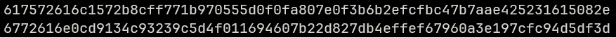</br>

e. After you have added your keys to the keystore for the second node under `/tmp/node2`, you can restart the node (step a.)

f. You should see that each node has one peer, same genesis block and state root hashes like the picture.

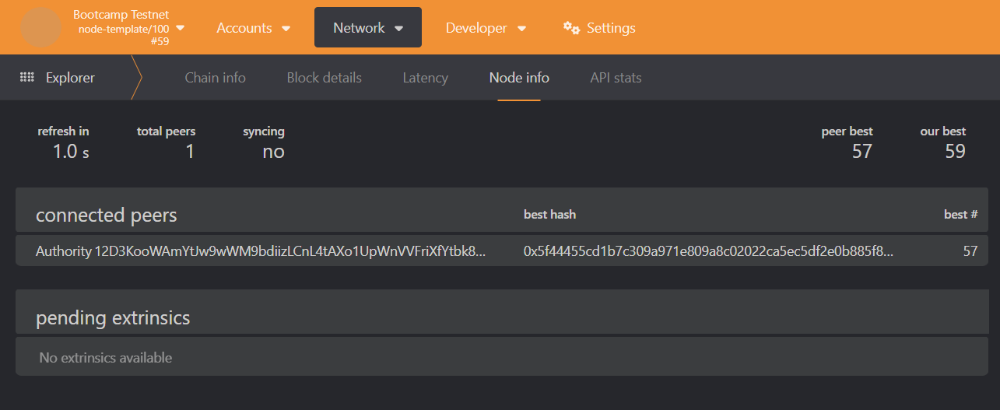</br>
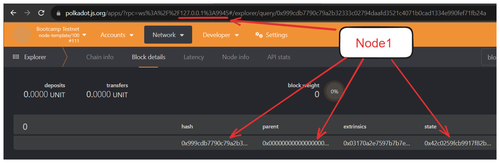</br>
</br>

## 5. Smart Contracts

### 5.1. Prerequisites

a. Installing `cargo-contract`

- Step 1: `rustup component add rust-src`
- Step 2: `cargo install --force --locked cargo-contract`
- Step 4: `cargo contract --help`

The step-3 is to verify the installation. If there is no error in this step, the installation is successful.

b. Install `substrate-contract-node`

- Step 1: `curl -L https://github.com/paritytech/substrate-contracts-node/releases/download/v0.31.0/substrate-contracts-node-linux.tar.gz > substrate-contracts-node-linux.tar.gz`
- Step 2: `tar -xf substrate-contracts-node-linux.tar.gz`
- Step 3: `sudo mv artifacts/substrate-contracts-node-linux/substrate-contracts-node /usr/bin/`
- Step 4: `substrate-contracts-node --help`
- Step 5: `rm -r artifacts/ substrate-contracts-node-linux.tar.gz`

The step-4 is to verify the installation. If there is no error in this step, the installation is successful.

### 5.2. Create a new smart contract project

This command create new smart contract project: 

```bash
cargo contract new flipper
```

Update the `lib.rs` file as desired. In this example, the updated file looks like this:

```rust
#![cfg_attr(not(feature = "std"), no_std, no_main)]

#[ink::contract]
mod flipper {

    #[ink(storage)]
    pub struct Flipper {
        value: bool,
    }

    impl Flipper {
        #[ink(constructor)]
        pub fn new(init_value: bool) -> Self {
            Self { value: init_value }
        }

        #[ink(constructor)]
        pub fn default() -> Self {
            Self::new(Default::default())
        }

        #[ink(message)]
        pub fn set_value(&mut self, new_value: bool) {
            self.value = new_value;
        }

        #[ink(message)]
        pub fn flip(&mut self) {
            self.value = !self.value;
        }

        #[ink(message)]
        pub fn get(&self) -> bool {
            self.value
        }
    }

    #[cfg(test)]
    mod tests {
        use super::*;

        #[ink::test]
        fn default_works() {
            let flipper = Flipper::default();
            assert_eq!(flipper.get(), false);
        }

        #[ink::test]
        fn it_works_set_value() {
            let mut flipper = Flipper::new(false);
            assert_eq!(flipper.get(), false);
            flipper.set_value(true);
            assert_eq!(flipper.get(), true);
        }

        #[ink::test]
        fn it_works_flip() {
            let mut flipper = Flipper::new(false);
            assert_eq!(flipper.get(), false);
            flipper.flip();
            assert_eq!(flipper.get(), true);
        }
    }
}
```

Run tests to make sure the code works:

```bash
# Change working directory to flipper
cargo test
```

If the console output looks like the picture, it means that all test cases have passed.

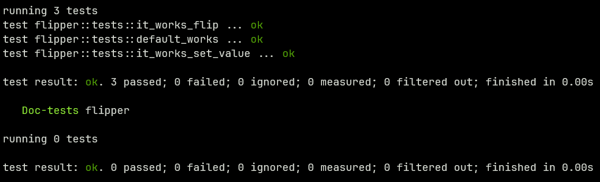

### 5.3. Compile the contract

Change the working directory to `flipper` and run the following command:

```bash
cargo contract build --release
```

This command build the contract and creates three files named `flipper.contract`, `flipper.json` and `flipper.wasm` in the `/target/ink` folder.

### 5.4. Run a Substrate node and deploy the contract

Run a node: 

```bash
substrate-contracts-node --log info,runtime::contracts=debug 2>&1
```

Go to https://contracts-ui.substrate.io/?rpc=ws://127.0.0.1:9944 page in your browser. And click on the `Add New Contract` button as shown in the picture and then click on the `Upload New Contract Code` button.

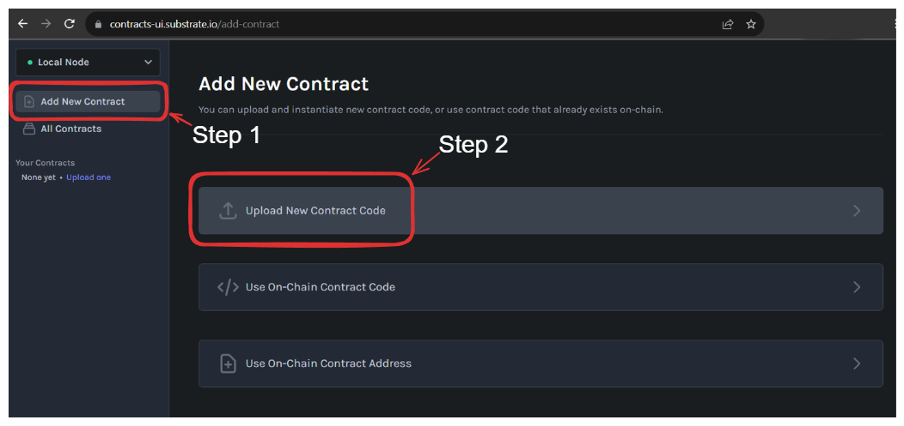</br>

On the page that opens, select an account, enter a descriptive name for the contract and upload the `flipper.contract` file created in the previous step to the `Upload Contract Bundle` section. If the file is valid, you should get **"Valid contract bundle!"** as shown in the image. Then click the next button.

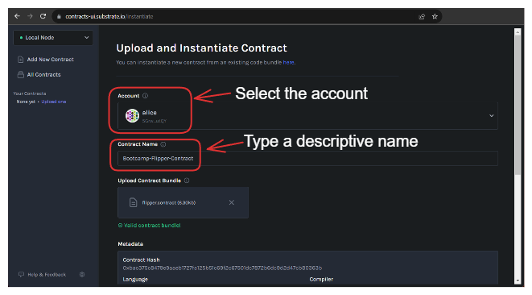</br>

Then select **"Deployment Constructor"** on the screen that appears and click the next button.

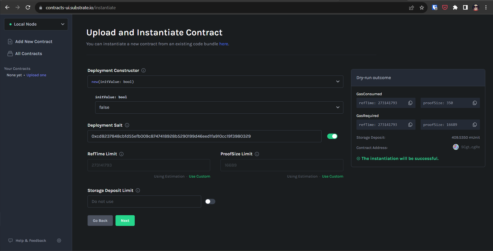</br>

Click the **"Upload and Instantiate"** button to confirm the information or go back and edit it.

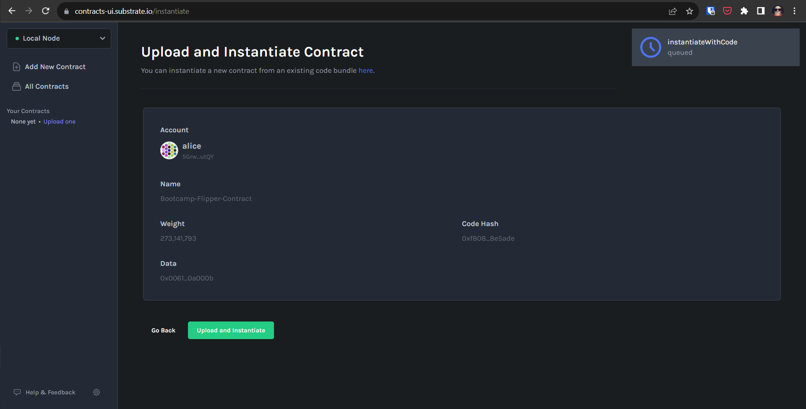</br>

After the contract is successfull uploaded, it is directed to a screen as shown in the image

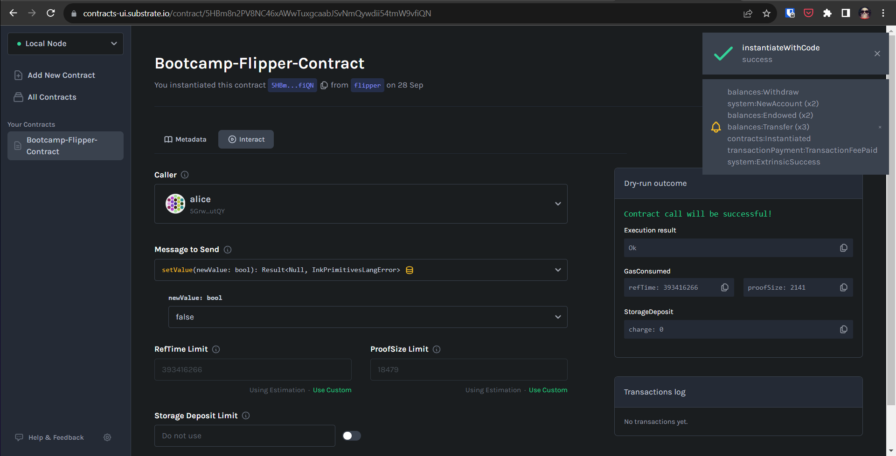</br>

### 5.5. Call the contract

#### 5.5.1. Call the contract with command line

a. Call the `get` function:

```bash
# The contract address created for this example is used. 
# It can be seen from the images in the previous steps that the address is the same.
cargo contract call --contract 5HBm8n2PV8NC46xAWwTuxgcaabJSvNmQywdii54tmW9vfiQN --message get --suri //Alice
```

Output:

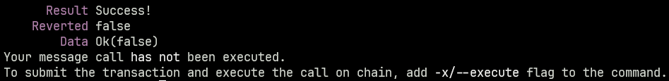</br>

b. Call the `flip` function:

```bash
# After running this command, press enter to confirm transaction.
cargo contract call --contract 5HBm8n2PV8NC46xAWwTuxgcaabJSvNmQywdii54tmW9vfiQN --message flip --suri //Alice -x
```

Output:

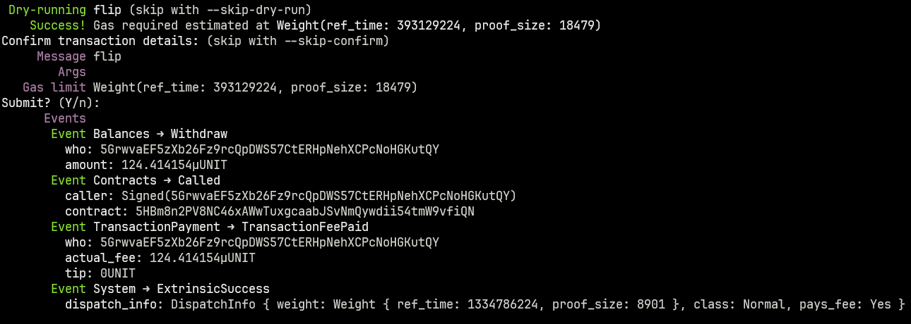</br>

b. Call the `set_value` function:

```bash
# After running this command, press enter to confirm transaction.
cargo contract call --contract 5HBm8n2PV8NC46xAWwTuxgcaabJSvNmQywdii54tmW9vfiQN --message set_value --args false --suri //Alice -x
```

Output:

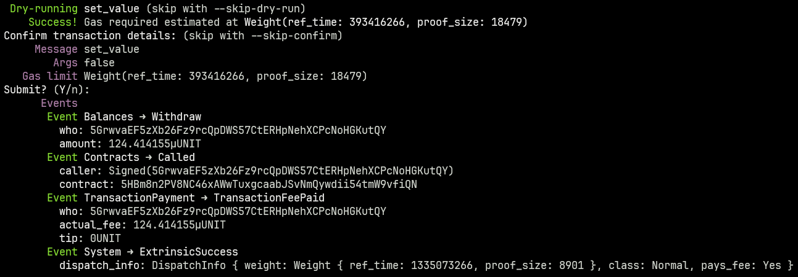</br>

#### 5.5.2. Call the contract with Contracts UI

a. Call the `get` function: Select **"get"** as **Message to Send** value.

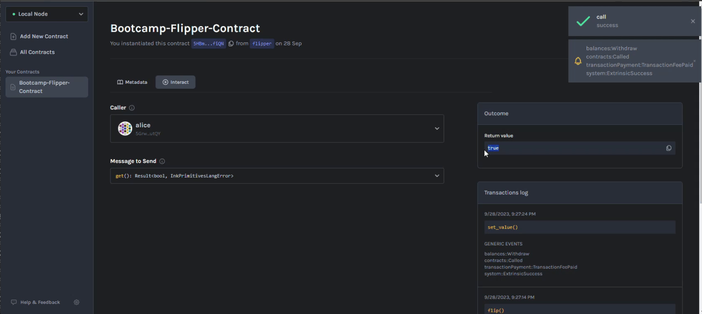</br>

b. Call the `flip` function: Select **"flip"** as **Message to Send** value then click **Call contract** button.

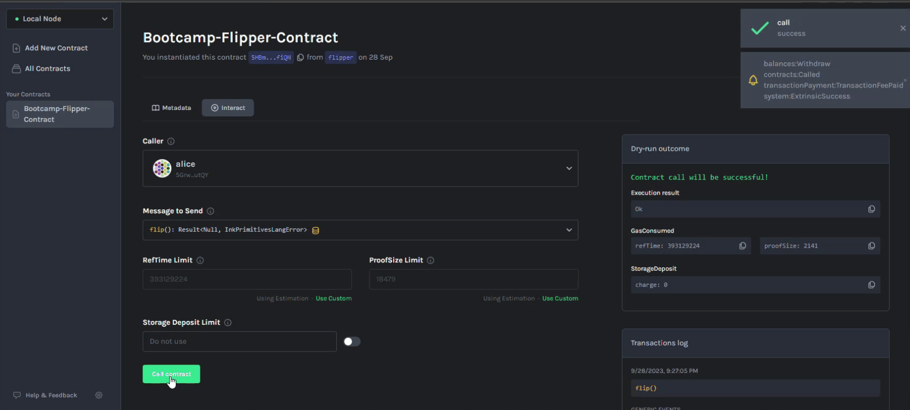</br>

b. Call the `set_value` function: Select **"setValue"** as **Message to Send** value then select the `newValue` data and click the **Call contract** button.

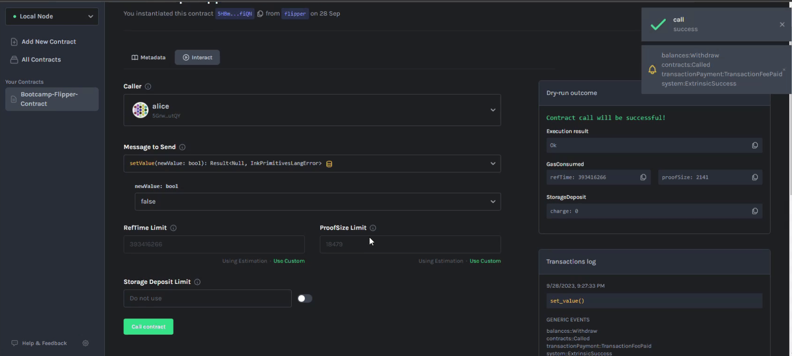</br>

## 6. References

- https://docs.substrate.io/
- https://use.ink/

## 7. License

```
MIT License

Copyright (c) 2023 Sertan Canpolat

Permission is hereby granted, free of charge, to any person obtaining a copy
of this software and associated documentation files (the "Software"), to deal
in the Software without restriction, including without limitation the rights
to use, copy, modify, merge, publish, distribute, sublicense, and/or sell
copies of the Software, and to permit persons to whom the Software is
furnished to do so, subject to the following conditions:

The above copyright notice and this permission notice shall be included in all
copies or substantial portions of the Software.

THE SOFTWARE IS PROVIDED "AS IS", WITHOUT WARRANTY OF ANY KIND, EXPRESS OR
IMPLIED, INCLUDING BUT NOT LIMITED TO THE WARRANTIES OF MERCHANTABILITY,
FITNESS FOR A PARTICULAR PURPOSE AND NONINFRINGEMENT. IN NO EVENT SHALL THE
AUTHORS OR COPYRIGHT HOLDERS BE LIABLE FOR ANY CLAIM, DAMAGES OR OTHER
LIABILITY, WHETHER IN AN ACTION OF CONTRACT, TORT OR OTHERWISE, ARISING FROM,
OUT OF OR IN CONNECTION WITH THE SOFTWARE OR THE USE OR OTHER DEALINGS IN THE
SOFTWARE.
```
